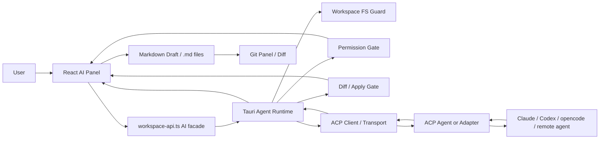

# 右侧 AI 面板 Agent Runtime 架构设计

**日期：** 2026-06-19
**状态：** 已确认，待实施

## 结论

Refinex Wiki 右侧 AI 面板的长期架构采用 **ACP-first Tauri Agent Runtime**。

右侧 React 面板不直接 spawn Claude / Codex / opencode CLI，也不把某一个供应商 SDK 作为主架构。AI 面板只面对一个统一的本地 `Agent Runtime` 契约；Tauri 原生层负责 agent 发现、进程生命周期、session、workspace 文件边界、权限请求、取消和事件桥；底层优先接入 ACP agent / ACP adapter。Claude Agent SDK、Codex SDK、裸 CLI 或直接 LLM provider 只能作为 adapter 或降级路径接入 runtime，不能绕过 runtime 直接接 UI。

这个方案比“先直接 spawn CLI”起步更重，但更适合本项目的长期目标：强能力、可替换 agent、清晰安全边界、桌面离线优先、Markdown-first 文档模型，以及未来接入远端 agent / MCP / 多 provider 的扩展空间。

## 背景

当前右侧 AI 面板已经有入口，但仍是占位：

- `components/workspace/ai-side-panel.tsx` 中 `AiPanelContent` 展示当前文档卡片、三个 quick action 按钮和 disabled textarea，并明确提示 `AI 能力尚未接入`。
- `components/editor/use-chat.ts` 只保留 `ChatMessage = UIMessage` 类型别名，没有真实消息协议。
- `app/api/ai/copilot/route.ts` 已有一个最小 Next route，使用 AI SDK `generateText`，读取请求内 `apiKey` 或 `AI_GATEWAY_API_KEY`。
- `scripts/build-tauri-web.mjs` 在桌面静态导出时会临时移走 `app/api`，因此桌面主能力不能依赖 Next API route。
- `src-tauri/capabilities/default.json` 当前没有 `shell:allow-spawn` 或 `shell:allow-execute`，说明前端不能也不应该直接获得通用 shell spawn 能力。
- `src-tauri/src/workspace.rs` 已经有 workspace root canonicalize、Markdown 文档路径校验、`.refinex` 保护和隐藏目录过滤。
- `src-tauri/src/terminal.rs` 已经有 session map、Tauri event bridge 和 cwd 校验，但它是人用 PTY，不适合作为 agent 协议通道直接复用。

历史设计已经把 Refinex Wiki 收敛为 Markdown-first：AI 应以 Markdown 真值作为最高优先级上下文，输出先校验、预览，再应用。

## 调研输入

### 本地参考项目

`/Users/refinex/develop/project/reference/acp-ui-main`

- 最值得参考的方向。它把 agent transport 抽象为 stdio / websocket / http，并通过 ACP JSON-RPC bridge 处理 session、stream update、permission request、mode、model、slash command。
- 它证明“UI 面向协议，不面向具体 CLI”是可行的。
- 但它的 host filesystem 读写边界较宽，不能直接照搬到 Refinex Wiki；本项目必须复用 workspace-scoped 校验和权限闸门。

`/Users/refinex/develop/project/reference/claudecodeui-main`

- 适合参考事件归一化、active session 管理、abort、token usage、工具调用展示和 SDK adapter 组织方式。
- 它通过 Claude Agent SDK、Codex SDK、opencode CLI 等多条路径接 agent，能快速做强能力，但长期会形成 adapter 分散和安全模型重复。
- 许可证和 Node/Electron/server 架构也不适合作为本项目直接基底。

`/Users/refinex/develop/project/reference/AionUi-main`

- 适合参考更成熟的进程注册表、健康检查、端口探测、sidecar lifecycle、数据库 session 持久化。
- Team Mode、多 agent 并行、MCP 管理都应作为后续路线，而不是 Refinex Wiki 第一版 AI 面板的起点。

`/Users/refinex/develop/project/reference/Claudable-main`

- 适合参考 CLI agent 检测、websocket streaming 和项目会话体验。
- 但它面向 app builder，并且部分路径使用 bypass / danger 权限，不能作为 Refinex Wiki 的默认安全策略。

### 官方资料

- ACP 官方文档说明 ACP 用于标准化 editor / IDE 与 coding agent 的通信，local agent 通过 JSON-RPC over stdio 作为编辑器子进程运行，remote agent 可通过 HTTP 或 WebSocket 接入，并包含权限请求、diff 等 agentic coding UX 类型。
- ACP Architecture 明确了 JSON-RPC、MCP-friendly、UX-first、permission request、concurrent sessions 和 streaming notifications 这些特征。
- ACP GitHub 仓库当前稳定 wire protocol version 为 `1`，并提供 Rust / TypeScript 等官方库；Rust crate 适合本项目 Tauri runtime 方向。
- Tauri v2 sidecar 文档说明，从 JavaScript 运行 sidecar 必须显式在 `src-tauri/capabilities/default.json` 增加 `shell:allow-execute` 或 `shell:allow-spawn`。本项目当前不授予这些权限，AI runtime 应由受控 Tauri command 管理，而不是前端直接 spawn。
- Codex SDK 和 Claude Agent SDK 都适合被 adapter 使用，但它们不是跨 agent 的共同协议。Codex TypeScript SDK 还要求 server-side Node 18+，不应放进桌面 webview 主通道。

参考链接：

- ACP Introduction: https://agentclientprotocol.com/get-started/introduction
- ACP Architecture: https://agentclientprotocol.com/get-started/architecture
- ACP GitHub: https://github.com/agentclientprotocol/agent-client-protocol
- Tauri sidecar permissions: https://v2.tauri.app/develop/sidecar/
- Codex SDK: https://developers.openai.com/codex/sdk
- Claude Agent SDK: https://github.com/anthropics/claude-agent-sdk-typescript

## 不采纳的主路径

### 不以直接 LLM provider 作为主架构

直接 LLM provider 最适合总结、解释、改写、生成大纲等文档级 quick action。它不能覆盖项目级 agent：读取多个文件、规划修改、运行命令、展示工具调用、处理权限、产出 diff、恢复 session。

现有 `app/api/ai/copilot/route.ts` 可以保留为 web/dev 的实验入口，但桌面静态导出时 `app/api` 不存在，不能把它作为桌面 AI 能力的唯一通道。未来如果要做纯文档 LLM provider，应作为 `Agent Runtime` 的 `provider adapter` 接入，密钥走本地设置或 secret storage，而不是让右侧面板直接持有真实密钥。

### 不以直接 CLI / SDK adapter 作为主架构

直接接 Claude Agent SDK、Codex SDK、opencode CLI 可以最快拿到强能力，但代价是：

1. 每个 agent 都要重复做 session、取消、权限、工具事件、diff、错误归一化。
2. CLI stdout / stderr 格式、SDK event schema、权限模型和版本演进都不一致。
3. 安全边界容易扩散到 React、Node sidecar 或多个 adapter 文件里。
4. 后续接 remote agent / MCP / 自定义 agent 时会继续增加分叉。

这些 adapter 可以存在，但必须挂在统一 runtime 后面。UI 不感知具体供应商。

### 不复用 Terminal PTY 作为 agent 通道

现有 terminal panel 是用户可见 shell，适合 xterm 字节流。Agent 通道需要 ACP JSON-RPC、request/response correlation、permission request、session update、diff payload、取消和超时。复用 terminal PTY 会把人用终端和机器协议混在一起，不利于可靠性、安全审计和测试。

可以复用 `terminal.rs` 的经验：session map、cwd 校验、reader thread、Tauri event emit、kill/cleanup。但 agent runtime 应独立实现。

## 最终架构



### 1. React AI Panel

位置：从 `components/workspace/ai-side-panel.tsx` 拆出 `components/workspace/ai-panel/*`。

职责：

- 展示对话流、agent 状态、当前文档上下文、quick actions、permission prompt、tool card、diff preview、错误态和停止按钮。
- 从当前 workspace/editor state 构造 `AiContextPack`：当前 Markdown、选区、文档路径、标题、TOC snapshot、是否 dirty、modifiedAt/contentHash。
- 只调用 `workspace-api.ts` 的 AI facade，不直接 import shell plugin，不直接 spawn 进程，不直接读写 host 文件。
- 对当前打开且未保存的文档，写入必须先走 preview，再应用到 editor draft；不能由 agent 盲写磁盘覆盖未保存内容。

第一版 UI 不追求完整 agent IDE，只需要：

- agent/profile 选择。
- 对话输入和 streaming 输出。
- 当前文档上下文 chips。
- quick actions：总结此页面、解释选中内容、生成大纲。
- stop / retry / clear。
- 权限请求卡片。
- diff preview 卡片。

### 2. `workspace-api.ts` AI facade

新增一组与现有 workspace/git/terminal 调用风格一致的 API：

```ts
export async function listAiAgentProfiles(rootPath: string): Promise<AiAgentProfile[]>;
export async function startAiSession(input: StartAiSessionInput): Promise<AiSessionInfo>;
export async function sendAiPrompt(input: SendAiPromptInput): Promise<void>;
export async function cancelAiTurn(sessionId: string): Promise<void>;
export async function stopAiSession(sessionId: string): Promise<void>;
export async function respondAiPermission(input: AiPermissionDecision): Promise<void>;
export async function listenAiEvents(handler: (event: AiRuntimeEvent) => void): Promise<UnlistenFn>;
```

所有 UI 状态都基于统一 `AiRuntimeEvent` reducer：

- `sessionStarted`
- `sessionResumed`
- `messageDelta`
- `messageCompleted`
- `thoughtDelta`
- `toolCallStarted`
- `toolCallUpdated`
- `permissionRequested`
- `diffProposed`
- `turnCompleted`
- `sessionExited`
- `error`

### 3. Tauri Agent Runtime

新增 Rust 模块，建议命名为 `src-tauri/src/agent_runtime.rs` 或 `src-tauri/src/ai.rs`。长期职责放在 Rust 原生层，而不是 React webview：

- agent profile 检测：检查用户本机可用 ACP adapter / agent 命令，生成可选择 profile。
- 进程生命周期：启动、复用、取消、kill、退出清理。
- ACP transport：优先 stdio，后续支持 websocket/http remote agent。
- session 管理：`sessionId`、`profileId`、`workspaceRoot`、ACP session id、状态、pending permissions、createdAt、lastActivity。
- workspace scoped filesystem：读写都必须 canonicalize，并拒绝访问 workspace 外、`.refinex` 内部元数据和显式跳过目录。
- permission gate：agent 请求读写、shell、MCP、外部访问时，runtime 统一转成 UI permission request。
- diff/apply gate：agent 提出的文件变更必须生成预览，用户确认后再通过既有 workspace 或 Git 边界应用。
- 日志最小化：不记录真实 API key、完整 prompt、敏感本地路径或上游原始错误。

ACP 实现优先使用官方 Rust crate。TypeScript ACP SDK 可以作为 schema 对照、测试夹具或临时兼容层，但最终架构中 React 不应成为 ACP runtime authority。

如果第一阶段 Rust ACP crate 集成成本超出预期，可以临时把 JSON-RPC envelope 解析实现为本地小模块，但外部契约仍保持 `Agent Runtime -> AiRuntimeEvent`，避免 UI 绑定具体 agent。

### 4. Agent Adapter

adapter 分四类，优先级如下：

1. `acp_stdio`：本地 ACP agent 或 ACP adapter。首选路径。
2. `acp_websocket` / `acp_http`：后续支持 remote agent，不进入第一版。
3. `sdk_sidecar`：Codex SDK / Claude Agent SDK 等需要 Node 或独立 runtime 的 adapter。必须作为受控 sidecar 或进程接入 Tauri runtime。
4. `provider`：纯 LLM provider，用于文档总结、解释、改写等非项目级能力。不能替代 agent runtime。

不建议直接支持“任意命令 + 任意参数”的自由配置。profile 应有 schema 和 allowlist：

```ts
interface AiAgentProfile {
  id: string;
  label: string;
  kind: 'acp_stdio' | 'acp_websocket' | 'sdk_sidecar' | 'provider';
  command?: string;
  args?: string[];
  envKeys?: string[];
  cwdMode: 'workspaceRoot' | 'home' | 'fixed';
  capabilities: {
    readWorkspace: boolean;
    writeWorkspace: boolean;
    shell: boolean;
    diff: boolean;
    models: boolean;
    slashCommands: boolean;
  };
  detection: {
    status: 'available' | 'missing' | 'misconfigured';
    message?: string;
  };
}
```

具体 adapter 命令、参数和版本在实施阶段本机检测确认，不在设计文档硬编码为永久事实。

## 上下文模型

AI 面板传给 runtime 的不是“整个 app 状态”，而是可审计的 `AiContextPack`：

```ts
interface AiContextPack {
  workspaceRootPath: string;
  document?: {
    path: string;
    title: string;
    markdown: string;
    modifiedAt: number | null;
    contentHash: string;
    dirty: boolean;
  };
  selection?: {
    markdown: string;
    from: number;
    to: number;
  };
  toc?: Array<{
    depth: number;
    text: string;
    line?: number;
  }>;
  intent: 'chat' | 'summarize-document' | 'explain-selection' | 'generate-outline' | 'edit-selection';
}
```

规则：

- 当前文档上下文以 Markdown 字符串为准。
- 对 dirty 文档，context 使用内存草稿；agent 对磁盘读取到的版本不能直接覆盖草稿。
- 写当前文档时必须对比 `contentHash` / `modifiedAt`，不匹配则进入冲突预览。
- 输出 Markdown 必须先经过 parser / frontmatter / fenced block 校验；破坏结构时拒绝自动应用。
- 多文件改动必须展示文件列表和 diff，再由用户逐项或整体确认。

## 权限模型

默认权限策略：

| 操作 | 第一版默认 | 说明 |
|---|---|---|
| 读取当前文档上下文 | 允许 | UI 主动传入，不等同于 agent 任意读盘 |
| 读取 workspace 内 `.md/.mdx` | 需要按 profile 声明，可先只读 | 必须走 workspace guard |
| 写当前文档 | 需要用户确认 diff | 应用到 editor draft 或 workspace API |
| 写其他 workspace 文件 | 需要用户确认 diff | 不能写 `.refinex` |
| 运行 shell 命令 | 第一版禁用或每次强确认 | 不走 terminal PTY |
| 访问 workspace 外路径 | 默认拒绝 | 除非未来有明确用户授权模型 |
| 读取/注入 API key | 默认拒绝 UI 读取 | runtime 只传声明的 env key |
| remote agent | 后置 | 需要单独网络和数据外发提示 |

`src-tauri/capabilities/default.json` 不应为了 AI 面板直接增加宽泛 `shell:allow-spawn`。如果未来必须使用 Tauri sidecar capability，应单独说明命令、参数 validator 和安全影响。

## Session 与持久化

第一版可以把 session 保存在内存中，退出应用后不恢复 agent 进程。需要保留的最小状态：

- profile id
- workspace root
- local session id
- agent protocol session id（如果 agent 返回）
- 消息摘要或最近消息（可选）
- pending permission 状态

后续可持久化到 `.refinex/ai/sessions.json` 或 app-level data dir，但要先确认是否属于 workspace 数据。建议原则：

- 与具体 workspace 内容相关的 session 元信息可以放在 workspace `.refinex`。
- 全局 provider 密钥、agent profile、用户偏好放 app-level settings/secret storage。
- 不默认持久化完整 prompt、完整文档正文或敏感路径。

## 实施路线

### v0.1：Runtime 骨架和只读对话

目标：

1. 拆出 AI panel 组件和事件 reducer。
2. 新增 `workspace-api.ts` AI facade。
3. 新增 Tauri `AgentRuntimeState`、profile 检测、session start/stop/cancel。
4. 接入一个 fake ACP echo agent 或本地 test adapter，用于不依赖真实 API 的测试。
5. UI 能显示 streaming message、错误、停止状态。

验收：

- 没有真实密钥也能跑 fake agent 测试。
- AI 面板能带当前 Markdown 文档上下文发起一次 turn。
- 停止按钮能取消当前 turn。
- agent 进程退出后 runtime 清理 session。

### v0.2：ACP stdio agent 接入

目标：

1. 接入至少一个本机可用 ACP adapter。
2. 支持 ACP initialize/newSession/prompt/cancel。
3. 支持 streaming notifications 转 `AiRuntimeEvent`。
4. 支持 mode/model/slash command 的只读展示（如果 agent 提供）。

验收：

- 用户能在右侧 AI 面板选择 agent 并完成一轮真实对话。
- agent 不可用时显示检测原因和安装提示，不崩溃。
- 不扩大前端 shell 权限。

### v0.3：权限、diff 和 Markdown apply

目标：

1. ACP permission request 转 UI 权限卡片。
2. 文件写入统一进入 diff preview。
3. 当前文档改写支持 apply 到 editor draft。
4. 多文件变更支持预览但默认不自动应用。
5. Git panel 能看到应用后的 Markdown diff。

验收：

- 未确认时不会写入文件。
- `.refinex` 和 workspace 外路径被拒绝。
- dirty 文档发生冲突时进入冲突预览。

### v0.4：provider adapter 和 SDK sidecar

目标：

1. 把现有 `app/api/ai/copilot` 的能力归并为 provider adapter 思路。
2. 支持本地 provider 配置和 secret storage。
3. 评估 Codex SDK / Claude Agent SDK 是否以 sidecar adapter 接入。

验收：

- 文档 quick actions 可选择 provider 或 agent。
- 桌面模式不依赖 Next API route。
- API key 不落入前端持久化或日志。

### v0.5：remote agent、MCP 和持久化

目标：

1. 支持 ACP websocket/http remote agent。
2. 支持 MCP server 配置传递或本地 MCP proxy。
3. 引入 session 历史和恢复策略。
4. 评估多 agent 并行和 team mode。

## 测试策略

### Rust / Tauri

- profile 检测：命令缺失、命令存在、env 缺失、args 校验。
- workspace guard：workspace 内读取、workspace 外拒绝、`.refinex` 拒绝、隐藏目录跳过。
- runtime session：start、cancel、stop、agent exit cleanup。
- permission：pending request、approve、deny、timeout。
- fake ACP transport：initialize、prompt streaming、permission request、error。

命令：

```bash
cargo test --manifest-path src-tauri/Cargo.toml
```

### TypeScript / React

- `AiRuntimeEvent` reducer。
- `AiContextPack` builder：当前文档、选区、dirty 状态、TOC。
- AI panel 状态：empty、connecting、streaming、permission、diff、error、stopped。
- `workspace-api.ts` facade 调用参数。

命令：

```bash
pnpm test:run -- components/workspace
pnpm test:run
```

### 安全和文档

- AI / shell / permission 相关改动必须跑 harness。
- 若改 `src-tauri/capabilities/default.json`、Tauri permissions、sidecar 或 secret storage，必须在 PR/交付中单独说明。

命令：

```bash
pnpm harness:check
pnpm lint
pnpm build:desktop:web
```

## 风险与应对

| 风险 | 影响 | 应对 |
|---|---|---|
| ACP ecosystem 仍在演进 | adapter 兼容性和协议细节可能变动 | runtime 内部封装协议，UI 只依赖 `AiRuntimeEvent` |
| Rust ACP runtime 初期成本较高 | 首版进度慢于直接 CLI | 用 fake ACP agent 和最小 stdio transport 先闭环 |
| SDK/CLI 能力比 ACP adapter 更丰富 | 个别供应商功能无法立即暴露 | SDK/CLI 作为 adapter 接入，不改变主架构 |
| agent 写文件存在数据损坏风险 | 可能覆盖 Markdown 或未保存草稿 | diff/apply gate、contentHash、parser 校验、dirty 冲突预览 |
| shell 权限扩大 | 本地安全风险上升 | 第一版禁用 shell 或逐次确认，不给前端通用 spawn 权限 |
| prompt / 路径 / key 泄露 | 隐私和安全风险 | 日志最小化，secret storage，remote agent 单独提示 |

## 回滚方式

本设计文档本身的回滚很简单：删除 `docs/superpowers/specs/2026-06-19-ai-panel-agent-runtime-design.md`。

未来实现回滚原则：

1. UI 层改动可先保留占位状态，关闭真实 runtime 入口。
2. Tauri runtime 模块可通过移除 invoke handler 和 state 管理回滚。
3. 不把 agent session 或 profile 写入不可逆迁移。
4. 不在第一版修改 CI、签名、installer、Tauri permission 清单或基础设施；如必须修改，单独审批。

## 最终决策

采用 `ACP-first Tauri Agent Runtime`。

第一阶段不要从“直接 spawn Claude/Codex CLI”开始，也不要把当前 `app/api/ai/copilot` 扩成桌面主通道。正确起点是先建立 runtime 契约、安全边界、上下文模型和 fake/test transport；随后接入 ACP stdio agent；再做权限、diff/apply 和 provider/SDK adapter。

这个顺序能把 AI 面板从占位升级为真正的本地 agent cockpit，同时保持 Refinex Wiki 的 Markdown-first、Tauri-native、安全默认和长期可维护性。
