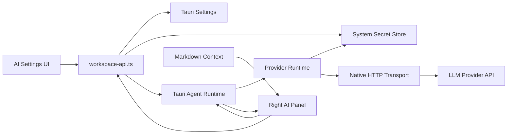

# AI Provider Runtime 与 Secret Store 设计

**日期：** 2026-06-19
**状态：** 已确认，待实施

## 结论

Refinex Wiki 的下一阶段 AI 能力应采用 **Provider-first + Tauri Native Transport + System Secret Store**。

右侧 AI 面板不能继续停留在 `Fake Echo` 和 adapter-pending 的本地账号检测状态。第一阶段应先支持真实 LLM provider：OpenAI、Anthropic、OpenRouter、Gemini、DeepSeek、Qwen、Ollama 和自定义 OpenAI-compatible。Provider 配置保存在 app settings，API key 不进入 settings JSON，必须通过 Tauri 原生层写入系统 secret store。

这个设计借鉴 `/Users/refinex/Downloads/markra-main` 的 provider 管理、模型能力、连接测试、模型列表拉取和 native HTTP stream 思路，但不直接复制 Markra 代码。Markra 仓库是 `AGPL-3.0-only`，本项目应重新实现适配自身架构的版本，避免不明确的授权影响和过度耦合。

## 背景

当前 AI 面板已有基础 runtime skeleton：

- `src-tauri/src/agent_runtime.rs` 提供 fake echo session 和本地 `codex` / `claude` 检测。
- `components/workspace/ai-panel/*` 提供右侧面板、context pack、reducer 和事件接收。
- `components/workspace/workspace-settings-dialog.tsx` 的 AI tab 可展示 Accounts / Models，但真实可用 runtime 仍只有 `fake-echo`。
- `app/api/ai/copilot/route.ts` 依赖 Next API route；桌面静态导出会移走 `app/api`，不能作为桌面 AI 主路径。
- `docs/superpowers/specs/2026-06-19-ai-panel-agent-runtime-design.md` 已确认长期方向是统一 Tauri Agent Runtime，不让 React 直接 spawn CLI。

用户选择了 **B：一开始就使用系统 Keychain / secret storage**。因此 provider 设置必须从第一版开始区分“可显示配置元数据”和“不可读回的 secret”。

## Markra 调研结论

Markra 的可借鉴点：

1. `packages/providers` 把 provider catalog、默认 base URL、模型列表、模型能力、API style、request style、custom headers 和模型列表拉取拆成独立包。
2. `AiProviderSettingsPanel` 使用左侧 provider 列表、右侧连接配置和模型配置，明显优于单个 model select。
3. `AiProviderConnectionSection` 支持 API style、API key、base URL、custom headers、测试连接。
4. `AiProviderModelsSection` 支持默认模型、模型启用开关、能力标签、手动添加模型、远端拉取模型列表。
5. `apps/desktop/src-tauri/src/ai_http.rs` 通过 Rust `reqwest` 执行 provider JSON 和 streaming chat 请求，适合桌面静态导出。
6. `useAiSettings` 将 inline model、agent model、global default model 分开，为未来行内 AI 和右侧 agent 面板预留了自然分层。
7. `useAiAgentSession` 管理会话、草稿、流式状态、thinking、web search 和 session persistence，右侧面板体验完整。

不直接照搬的点：

1. Markra 是 `AGPL-3.0-only`，本项目不能直接复制实现作为默认路径。
2. Markra 的 agent / diff / preview 工具体系强依赖其 Milkdown 编辑器、selection anchor 和 document tool model，不能原样映射到当前 Markora / Markdown-first 架构。
3. Markra settings store、i18n、UI 包和 monorepo 包结构与本项目不同；本项目应优先复用 `components/ui`、`workspace-api.ts` 和 `src-tauri/src/settings.rs`。
4. Markra 把 API key 放在 provider config 中；本项目首版必须走系统 secret store。

## 目标

1. AI 设置页提供专业 provider 管理能力，而不是单一 profile 下拉。
2. 支持真实 provider 对话，右侧 AI 面板可使用当前 Markdown 文档上下文完成 read-only chat。
3. API key 不保存到 app settings JSON，不通过 React state 长期持有，不出现在测试快照或日志中。
4. Provider 请求由 Tauri 原生层执行，桌面静态导出不依赖 Next API route。
5. 保留当前本地 Codex / Claude 检测，但把它作为 `Assistant Accounts`，与 LLM provider 配置分开。
6. 与长期 ACP-first Agent Runtime 保持兼容：provider runtime 是 `Agent Runtime` 的一个 adapter，不是绕过 runtime 的 UI 直连。

## 非目标

1. 不在第一阶段实现文档写入工具、diff preview、apply gate。
2. 不在第一阶段把 Codex app-server 或 Claude CLI 接成真实会话。
3. 不引入 Markra 的 monorepo 包、AGPL 源码或 pi-agent-core。
4. 不新增宽泛 Tauri shell/process 权限。
5. 不在 settings JSON 中保存 API key、access token、refresh token 或会话凭据。

## 架构



### 1. Provider Catalog

新增前端侧 provider catalog 模块，建议位置：

- `components/workspace/ai-provider/provider-types.ts`
- `components/workspace/ai-provider/provider-catalog.ts`
- `components/workspace/ai-provider/provider-settings.ts`

核心类型：

```ts
type AiProviderApiStyle =
  | 'openai'
  | 'openai-compatible'
  | 'openai-responses'
  | 'anthropic'
  | 'google'
  | 'ollama';

type AiModelCapability =
  | 'text'
  | 'vision'
  | 'reasoning'
  | 'tools'
  | 'web';

interface AiProviderModel {
  id: string;
  name: string;
  enabled: boolean;
  capabilities: AiModelCapability[];
}

interface AiProviderConfig {
  id: string;
  name: string;
  type: AiProviderApiStyle;
  apiStyle: AiProviderApiStyle;
  enabled: boolean;
  baseUrl: string;
  defaultModelId: string;
  models: AiProviderModel[];
  customHeaders?: string;
  secretStatus: 'configured' | 'missing' | 'notRequired';
}

interface AiProviderSettings {
  defaultProviderId: string | null;
  defaultModelId: string | null;
  agentDefaultProviderId: string | null;
  agentDefaultModelId: string | null;
  inlineDefaultProviderId: string | null;
  inlineDefaultModelId: string | null;
  providers: AiProviderConfig[];
}
```

首批内置 provider：

- `openai`: OpenAI Responses / Chat Completions。
- `anthropic`: Anthropic Messages。
- `openrouter`: OpenAI-compatible。
- `google`: Gemini。
- `deepseek`: OpenAI-compatible。
- `qwen`: OpenAI-compatible，默认 DashScope compatible endpoint。
- `ollama`: 本地 OpenAI-compatible，不需要 API key。
- `custom-openai-compatible-*`: 用户自定义 provider。

### 2. App Settings

`src-tauri/src/settings.rs` 扩展 `AiSettings`：

```rust
pub struct AiSettings {
    pub enabled_profile_id: Option<String>,
    pub profiles: Vec<AiProfileSettings>,
    pub providers: Vec<AiProviderSettings>,
    pub default_provider_id: Option<String>,
    pub default_model_id: Option<String>,
    pub agent_default_provider_id: Option<String>,
    pub agent_default_model_id: Option<String>,
    pub inline_default_provider_id: Option<String>,
    pub inline_default_model_id: Option<String>,
}
```

Rust settings 只校验 provider 元数据：

- `id`、`name`、`type`、`api_style`、`base_url`、`models` 必须合法。
- `custom_headers` 必须是 JSON object 或空字符串。
- `api_key`、`token`、`secret` 等字段不允许出现在 settings JSON。
- `ollama` 可以是 `secretStatus = notRequired`。

### 3. Secret Store

新增 Tauri secret store 模块，建议位置：

- `src-tauri/src/ai_secret.rs`

Tauri commands：

```rust
#[tauri::command]
pub fn get_ai_provider_secret_status(provider_id: String) -> Result<AiSecretStatus, String>;

#[tauri::command]
pub fn save_ai_provider_secret(provider_id: String, secret: String) -> Result<AiSecretStatus, String>;

#[tauri::command]
pub fn delete_ai_provider_secret(provider_id: String) -> Result<AiSecretStatus, String>;
```

行为要求：

1. 前端不能读取明文 secret，只能写入、删除、查询状态。
2. Secret service key 使用稳定命名：`refinex-wiki.ai-provider.<providerId>`。
3. Provider id 必须通过 allowlist / schema 校验，禁止路径、控制字符、空白 id。
4. 日志和错误信息不能包含 secret。
5. 单测使用 in-memory fake secret backend；真实 backend 用集成测试或手动验证。

实现依赖建议：

- 优先评估 Rust `keyring` crate，因为它覆盖 macOS Keychain、Windows Credential Manager、Linux Secret Service。
- 如果引入 `keyring` 需要系统依赖，实施计划中必须单独列出 macOS / Windows / Linux 验证项。

### 4. Native AI HTTP Transport

新增 Tauri provider HTTP 模块，建议位置：

- `src-tauri/src/ai_http.rs`

Tauri commands：

```rust
#[tauri::command]
pub async fn request_ai_provider_json(input: AiProviderJsonRequest) -> Result<AiProviderJsonResponse, String>;

#[tauri::command]
pub async fn request_ai_chat(input: AiChatRequest) -> Result<AiProviderJsonResponse, String>;

#[tauri::command]
pub async fn request_ai_chat_stream(input: AiChatRequest, on_event: Channel<AiChatStreamEvent>) -> Result<AiProviderJsonResponse, String>;
```

Rust transport 负责：

1. 校验 URL 只能是 `http` / `https`。
2. 按 provider id 从 secret store 读取 API key。
3. 合成 auth headers：Bearer、`x-api-key`、`x-goog-api-key` 等。
4. 执行 GET `/models`、POST chat / messages / responses。
5. 对 stream chunk 做 UTF-8 边界处理并通过 Tauri `Channel` 发回前端。
6. 设置合理 timeout：模型列表 20s，chat 60s。

前端 provider adapter 负责：

- 根据 `apiStyle` 构造 endpoint、body、headers 中的非 secret 部分。
- 解析 provider response / stream event 为统一 `AiRuntimeEvent`。
- 不直接接触 API key。

### 5. AI Settings UI

`WorkspaceSettingsDialog` 的 AI tab 改为专业配置面板：

左侧：

- Provider 搜索。
- Provider 列表：名称、启用状态、secret 状态、默认模型。
- 添加自定义 OpenAI-compatible provider。
- `Assistant Accounts` 区块保留 Codex / Claude 本地检测，视觉上与 Provider 分开。

右侧：

- Header：provider 名称、启用开关、删除自定义 provider。
- Connection：
  - API style。
  - Base URL。
  - API Key 状态。
  - 设置/替换 API key。
  - 删除 API key。
  - 测试连接。
  - Custom headers JSON。
- Models：
  - Provider 默认模型。
  - 模型列表启用开关。
  - 能力标签。
  - 手动添加/编辑模型。
  - 拉取模型列表。
- Defaults：
  - 右侧 AI 面板默认 provider/model。
  - 行内 AI 默认 provider/model 预留字段。

UI 要求：

1. 不显示 API key 明文。
2. 保存按钮只保存 provider 元数据。
3. 写入 key 后立即刷新 secret status。
4. 未配置 key 的 provider 不可作为可用 chat runtime，Ollama 除外。
5. 错误提示必须区分：缺少 key、连接失败、模型列表为空、provider 不支持当前请求。

### 6. Right AI Panel

第一阶段右侧 AI 面板改为真实 read-only chat：

1. 读取 `agentDefaultProviderId` / `agentDefaultModelId`。
2. 若没有可用 provider，展示“配置 AI provider”空状态。
3. 有可用 provider 时，composer 可发送消息。
4. 每次 turn 发送：
   - 当前 workspace root。
   - 当前 Markdown 文档标题、路径、content hash、dirty 状态、Markdown 文本。
   - 当前用户 prompt。
   - 最近历史消息，首版可限制 10 条。
5. Streaming 输出 assistant message。
6. 取消请求只在前端停止接收和标记 interrupted；真正的 native abort 可作为后续增强。

首版 system prompt：

```text
You are Refinex Wiki AI, a local-first Markdown knowledge-base assistant.
Use only the current Markdown document and workspace context provided in this turn.
Reply in the user's language unless the user asks otherwise.
Do not claim to have read files, searched the web, or changed the document unless the runtime provided that capability.
For edit requests, provide a clear proposed edit in Markdown. Do not imply it has been applied.
```

### 7. 与 Codex / Claude Accounts 的关系

Provider API 与本地 assistant accounts 是两条通道：

- Provider API：OpenAI / Anthropic / OpenRouter / Ollama 等，第一阶段提供真实 read-only chat。
- Assistant Accounts：本地 Codex / Claude CLI 或未来 ACP adapter，用于项目级 agent 能力。

设置页中必须分开显示，避免用户把“检测到 Codex CLI”理解成“Codex runtime 已经接入”。当前 Codex / Claude 检测仍保留，但只有在对应 adapter 完成后才进入可用模型列表。

## 数据流

### 测试连接

1. 用户在设置页选中 provider。
2. 前端调用 `save_ai_provider_secret` 写入 key。
3. 前端调用 `request_ai_provider_json` 拉取模型列表或执行 provider health check。
4. Rust 从 secret store 读取 key，加 auth header，执行请求。
5. 前端显示连接结果，不保存 response 中的敏感 header。

### 模型列表拉取

1. 前端根据 provider metadata 构造 `/models` request。
2. Rust native transport 发请求。
3. 前端解析 models，合并已有启用状态。
4. 用户确认保存后写入 settings JSON。

### 右侧 AI 对话

1. AI 面板读取 app settings 和可用 provider/model。
2. 用户发送 prompt。
3. 前端构造统一 chat request，不包含 secret。
4. Rust native transport 注入 secret 并发起 streaming request。
5. 前端将 stream delta 归一化成 `AiRuntimeEvent::MessageDelta`。
6. 面板 reducer 更新 transcript。

## 错误处理

- Secret 写入失败：提示系统凭据服务不可用，不修改 provider enabled 状态。
- Secret 缺失：provider 可保存但不可用于 chat。
- Provider 测试失败：保留配置，显示 HTTP 状态和安全化错误摘要。
- 模型列表为空：不覆盖已有模型列表。
- Stream 中断：保留用户消息和已收到 assistant delta，状态显示 interrupted/error。
- Settings JSON 损坏：沿用现有 settings fallback，不读取或写入 secret。

## 安全策略

1. 不把 API key 存入 settings JSON、localStorage、URL、日志、测试 fixture。
2. React state 只短暂持有用户输入的 key，写入 secret store 后立即清空 input。
3. Rust 错误返回必须 sanitize，不包含 request headers。
4. Provider URL 只允许 http/https。
5. Custom headers 不能覆盖认证 header，至少禁止 `authorization`、`x-api-key`、`x-goog-api-key`、`api-key`。
6. 不新增 shell/process 权限。
7. 如果引入 `keyring` 或等价依赖，必须在 PR 描述中单独列出安全影响。

## 测试策略

前端：

- Provider settings normalize/default tests。
- Secret status UI tests。
- Provider list/search/add custom provider tests。
- Connection section test：key input 不回显、不保存明文。
- Models section test：拉取模型、合并 enabled、默认模型 fallback。
- AI panel test：无 provider 空状态、可用 provider streaming、错误显示。

Rust：

- Secret backend trait 的 fake backend 单测。
- Provider id validation。
- Settings JSON reject secret fields。
- HTTP URL validation。
- Header sanitization。
- Stream UTF-8 chunk boundary。
- Tauri command wrapper tests where practical。

集成：

- macOS Keychain 手动验证。
- `pnpm test:run`。
- `cargo test --manifest-path src-tauri/Cargo.toml`。
- `pnpm lint`。
- `pnpm build:desktop:web`。
- `pnpm harness:check`。
- Playwright visual check：AI settings provider panel 和右侧 AI panel。

## 实施切片

### Slice 1：Provider settings schema 与 Secret Store

- 新增 provider types/catalog/defaults。
- 扩展 app settings schema。
- 新增 Rust secret store trait 和 Tauri commands。
- 设置页显示 provider list 和 secret status，但不发真实 chat。

### Slice 2：Native provider HTTP 与连接测试

- 新增 `ai_http.rs`。
- 实现 provider models request、test connection、model list parsing。
- 设置页支持测试连接和拉取模型。

### Slice 3：右侧 AI 面板真实 read-only chat

- 将 selected provider/model 映射成 AI runtime profile。
- 实现 OpenAI-compatible / Anthropic / Google 基础 chat request adapter。
- 支持 streaming delta 到现有 reducer。
- Fake Echo 降级为测试 runtime。

### Slice 4：体验增强

- 会话历史持久化。
- quick action prompt 可配置。
- thinking / web search capability gating。
- Codex app-server / Claude adapter 回到 Assistant Accounts 通道实施。

## 回滚策略

1. Secret Store commands 可独立回滚，不迁移 settings JSON。
2. Provider settings 字段通过 defaults 兼容旧 settings；回滚时旧 `ai.profiles` 和 `fake-echo` 仍可工作。
3. Native HTTP transport 独立于 workspace、Git、terminal，不影响核心文档编辑。
4. 设置页保留 `Fake Echo` fallback，真实 provider 出问题时可禁用 provider runtime。

## 需要用户确认的后续实施边界

已确认：

- API key 首版进入系统 Keychain / secret storage，而不是 settings JSON。
- 首个实施目标是 provider API 真实对话，而不是先接 Codex / Claude CLI adapter。

实施计划阶段还需要明确：

1. 是否接受新增 Rust secret store 依赖，例如 `keyring`。
2. 首批 provider 是否按 OpenAI、Anthropic、OpenRouter、Ollama、Qwen、自定义 OpenAI-compatible 收敛，Gemini / DeepSeek 放第二批。
3. 第一版是否只做 streaming text，不做 image/vision 输入。

